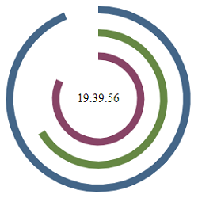

# Clock-React-JS
> English not my first language

Simple React JS page that displays a clock using SVG
This project was bootstrapped with [Create React App](https://github.com/facebook/create-react-app).

## Table of contents
- [Introduction](#introduction)
- [Technologies](#technologies)
- [Illustrations](#illustrations)

## Introduction
This project is a practice for introduction to React JS and React Hooks. It displays a simple clock using SVG to draw the clock hands.

## Technologies
- NodeJS v15.8.0

## Illustrations

